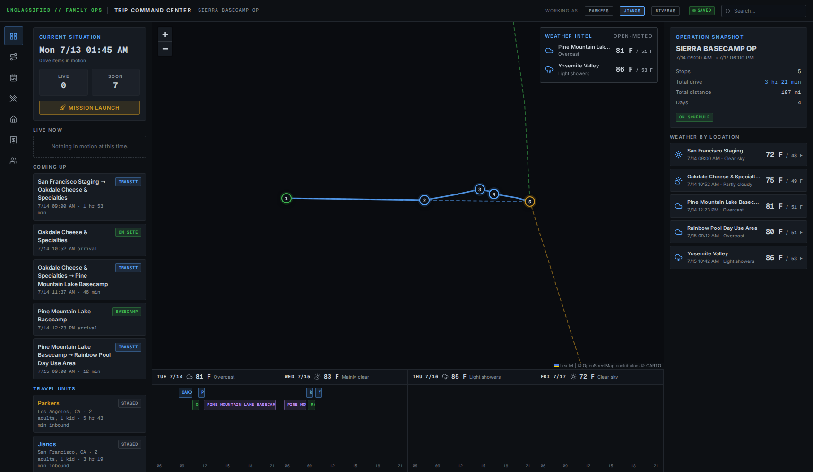
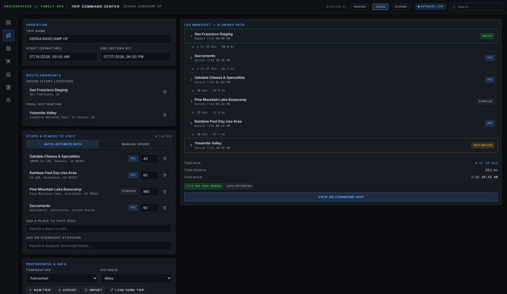
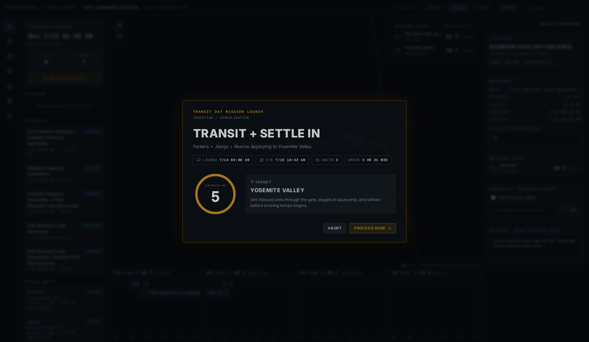

# Trip Command Center

Plan trips like an operation: optimized routes, arrival windows, weather intel, meal
logistics, expense splits, and a giant dark map — inspired by
[palantir-for-family-trips](https://github.com/andrewjiang/palantir-for-family-trips),
rebuilt to be **completely free to run**. No API keys, no accounts, no billing, no backend.



## What it does

- **Trip setup** — enter start/end dates, an origin, a final destination, optional
  overnight stopovers, and every place you want to visit.
- **Best-path planning** — the app fetches real driving times between all stops and
  auto-orders them for the shortest total drive (nearest-neighbor + 2-opt over the OSRM
  duration matrix). Toggle to **manual order** and drag stops to rearrange; times
  recalculate live.
- **Leg manifest** — drive time and distance for every leg, arrival/departure ETA at every
  stop, total drive, total distance, and an on-schedule / overrun check against your end date.
- **Weather for each location** — Open-Meteo daily forecast on each stop's arrival date
  (high/low, conditions, precipitation), in the inspector rail, the map's weather-intel
  overlay, and the per-day timeline strip.
- **Command dashboard** — dark ops-center map with numbered stops, route polylines,
  inbound family convoy routes, a day-by-day mission timeline, and a scenario time scrub
  with route playback.
- **Mission launch** — a countdown overlay for transit day, because group travel deserves
  drama.
- **Full logistics surfaces** — activity board (day missions with fallbacks), shared meal
  plan, accommodations, expense ledger with even-split settlement, and travel-unit
  (family) management.
- **Autosave** — everything persists to your browser's localStorage. Export/import trips
  as JSON. Multiple trips supported.




## Zero-cost by design

| Capability | Service | Cost |
|---|---|---|
| Map tiles | [CARTO dark basemap](https://carto.com/attributions) (OpenStreetMap data) | Free with attribution |
| Driving times & routes | [OSRM public server](https://project-osrm.org/) | Free, keyless |
| Location search | [Photon](https://photon.komoot.io/) (OpenStreetMap geocoder) | Free, keyless |
| Weather | [Open-Meteo](https://open-meteo.com/) | Free, keyless (non-commercial) |
| Fonts | Inter + Geist Mono, bundled locally via Fontsource | Free, open source |
| Storage | Browser localStorage | Free |
| Hosting | Static files — GitHub Pages / Netlify / Vercel free tiers | Free |

There is no `.env`, no key to provision, and nothing that can ever send you a bill.

The public OSRM and Photon instances are fair-use community services — the app debounces
autocomplete, caches every matrix/route/forecast response, and issues one table call per
replan. If a service is unreachable, the planner degrades to straight-line estimates and
shows an amber `OFFLINE ESTIMATE` chip instead of failing. For a heavily trafficked public
deployment, consider [self-hosting OSRM](https://github.com/Project-OSRM/osrm-backend) and
[Photon](https://github.com/komoot/photon).

## Run it

```bash
npm install
npm run dev
```

Open the printed URL (default `http://localhost:5173`). A demo trip loads on first visit —
open **Route & trip setup** (second sidebar icon) to plan your own, or press
**Load demo trip** to get the sample back.

```bash
npm run build   # static production build in dist/
```

## Deploy to GitHub Pages

A workflow at `.github/workflows/deploy-pages.yml` builds and publishes the site on every
push to the default branch. One-time setup: in the repository's **Settings → Pages**, set
**Source** to **GitHub Actions**. The site then goes live at
`https://<your-username>.github.io/tripplanner/` (the build uses relative asset paths, so
it works from any URL). You can also trigger a deploy manually from the Actions tab.

## Stack

React 19 · Vite · Leaflet + react-leaflet · Framer Motion · Lucide icons · date-fns.
State is plain JSON in localStorage — no server, no database.

## Where things live

- `src/state/` — trip data model, localStorage persistence, demo seed, app context
- `src/lib/` — geocoding, OSRM routing + caching + offline fallback, path optimizer,
  day-by-day scheduler, Open-Meteo weather, playback interpolation
- `src/views/` — one file per surface (dashboard, setup, activities, meals, lodging,
  expenses, families); dashboard subcomponents in `src/views/dashboard/`
- `src/overlays/MissionLaunch.jsx` — the countdown overlay
- `src/index.css` — the whole design system (dark-only tokens per the reference's
  Palantir-style spec)
